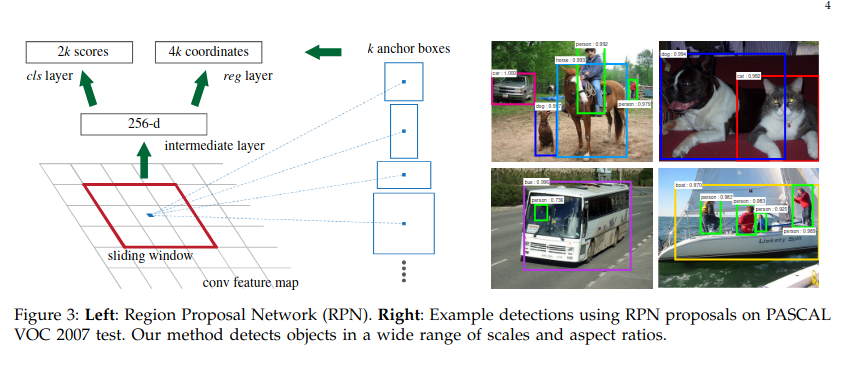

> Here I am listing all the references of the work of object detection in computer vision.  
>
> 

## Introduction : 
**RCNN :** Paper : https://arxiv.org/pdf/1311.2524

Link : https://blog.roboflow.com/what-is-r-cnn/

They are doing selective search to find the region of interest, and warping that region, then they are using CNN to extract the features from that region of interest. Then there is a SVM classifier that classifies the object in that region of interest. After that there is a bounding box regressor that refines the bounding box of the object in that region of interest. Then they are doing non maximum suppression to remove the overlapping bounding boxes.

**Fast R-CNN :** Paper : https://arxiv.org/pdf/1504.08083

blog : https://roboflow.com/model/faster-r-cnn

**Faster R-CNN :** Paper : https://arxiv.org/pdf/1506.01497

Losses used in above methods : 
Classification Loss (Lcls​): This is a Log Loss over the K+1 classes (K object classes plus one background class). It penalizes the model for incorrect class predictions.

Bounding Box Regression Loss (Lreg​): To improve the localization accuracy, Fast R-CNN uses a Smooth L1 Loss. This loss function is less sensitive to outliers compared to the L2 loss (MSE) used in R-CNN. The Smooth L1 loss behaves like an L2 loss for small errors and an L1 loss for large errors, making it more robust

People then say : 

Single-shot object detection uses a single pass of the input image to make predictions about the presence and location of objects in the image. It processes an entire image in a single pass, making them computationally efficient.

Two-shot object detection uses two passes of the input image to make predictions about the presence and location of objects. The first pass is used to generate a set of proposals or potential object locations, and the second pass is used to refine these proposals and make final predictions. This approach is more accurate than single-shot object detection but is also more computationally expensive.

**Yolo :** Paper : 
Above RCNN based methods were very slow. 

**Yolo v2:** 

It introduces the concept of anchor boxes, which are predefined bounding boxes of different aspect ratios and scales. The model predicts offsets to these anchor boxes to generate final bounding boxes. This allows the model to handle objects of different sizes and shapes more effectively.

It also use batch normalization to improve training stability and speed.

It also use multi scale training, where the model is trained on images of different resolutions. This helps the model to learn features at different scales and improves its ability to detect objects of varying sizes.

Also introduces a new loss function - sum of squared errors for the bounding box coordinates and cross-entropy loss for the class predictions

**Yolo v3 :** Paper :

CNN used is Darknet-53. and anchor boxes 

**Yolo v4 :** Paper :

CNN used is CSPDarknet53. and anchor boxes 

**YoloV5 :** Paper : No paper 
Architecture : https://docs.ultralytics.com/yolov5/tutorials/architecture_description/#2-data-augmentation-techniques

References : 
https://blog.roboflow.com/what-is-an-anchor-box/

https://medium.com/clique-org/panet-path-aggregation-network-in-yolov4-b1a6dd09d158

It uses CSPDarknet53 , uses , SPPF , and PanNet BiFPN feature pyramid network.

It uses dynamic anchor boxes, which are generated based on the dataset and can adapt to different object sizes and aspect ratios. 

It used spatial pyramid pooling, a type of pooling layer , used to improve the model's ability to detect objects at small scales. 

Instead of Iou it uses CIou loss

Can we make yolov5 only work for small 
object ? 
PAN is used for small object also , 
how to make it work only for small object ?  https://medium.com/clique-org/panet-path-aggregation-network-in-yolov4-b1a6dd09d158 

understand yolov4 : 

https://medium.com/@shreejaltrivedi

