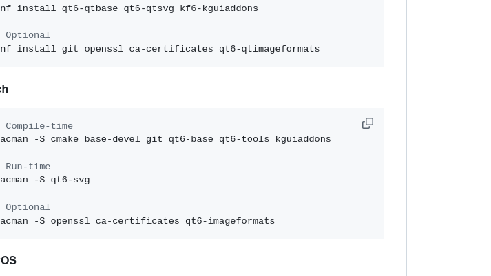

> [[Paper](https://doi.org/10.48550/arXiv.2411.11922)]  
> Good tutorial links : [[Blog]()]
> Meta AI Research, FAIR

## Introduction : 

Revisit SAM2 : contains (1) an image encoder, (2) a mask decoder with a prompt encoder, (3) a memory attention layer, and (4) a memory encoder. 

Kalman Filter : 
the state vector is center of bounding box and height width , and velocity 

Frame 1

No prior state exists, so we initialize KF: 
x(0,0) = z0

 = measurement derived from the mask selected by SAM2 (usually highest affinity score).

No prediction yet; we just record the initial state.

Candidate masks exist, but since it’s the first frame, selection is based solely on affinity score.

based on motion model F , kalman filter predict the next bounding box 

Frame 2 , 
kalman filter get the motion field calulates the F and predicts for this frame . 
kalman filter predicts for x(1,0) for frame 2 based on motion field for frame 1. 

get iou score of (x(1,0) and Mi)  and sam2 also give affinity score of that mask , 
so it takes max score from all the masks , and take that masks basically that has highest score. 

Pick mask 
M∗ with highest combined score.

Update KF with selected mask:
 = corrected object state for Frame 2

💡 Intuition: “Use motion prediction to guide mask selection, then correct with the measurement.”

