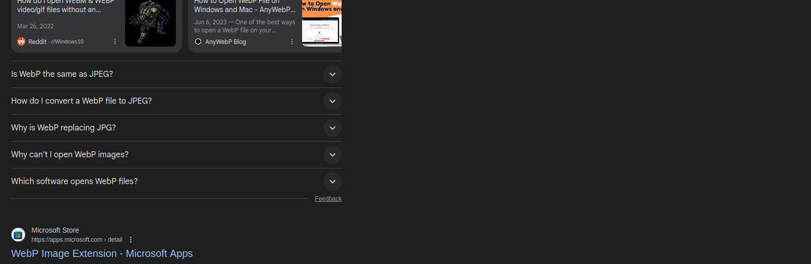
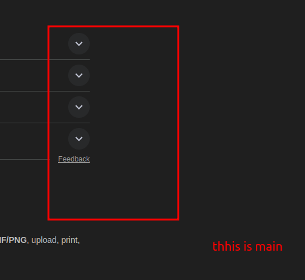
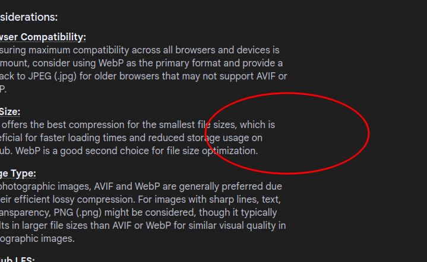

# How to run this repository : 

# 1. Install the ruby
sudo apt update
sudo apt install ruby-full build-essential zlib1g-dev

# 2. Install Bundler and Jekyll gems
sudo gem install bundler jekyll

# 3. Go to your project folder
cd ~/charvi-work/kimjy99.github.io

# 4. Install project dependencies
bundle install

# 5. Serve the site locally
bundle exec jekyll serve

# 6. Configure your snippets 

in settings > snippets > add markdown snippets 

So for writing post : 
1. to add image I added 

